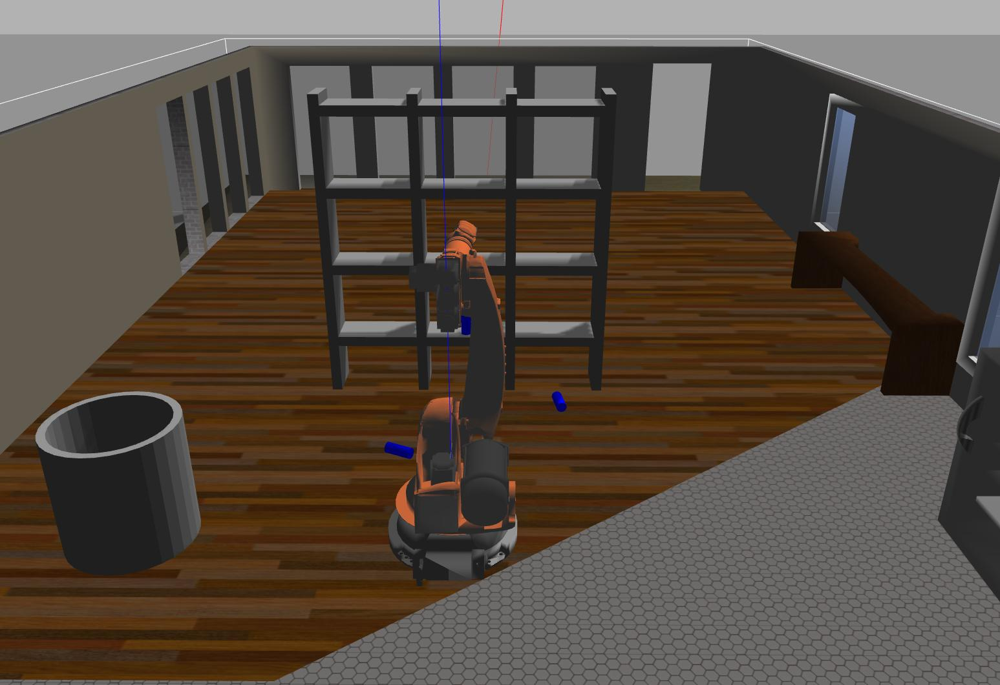
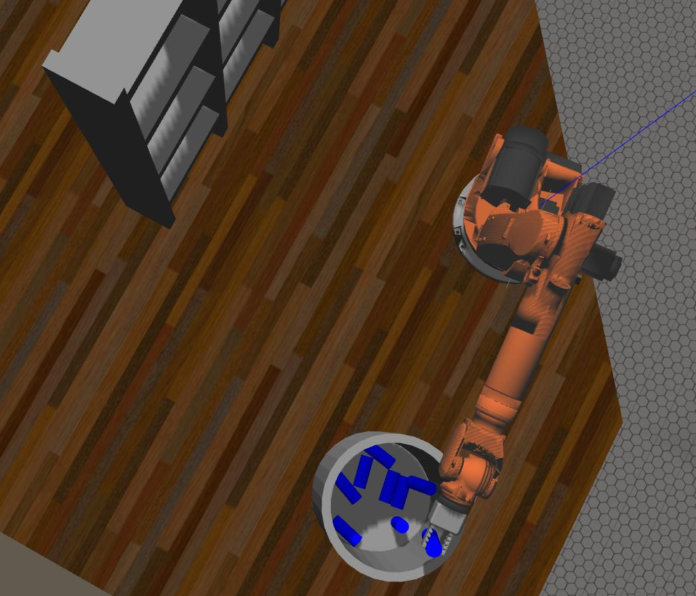
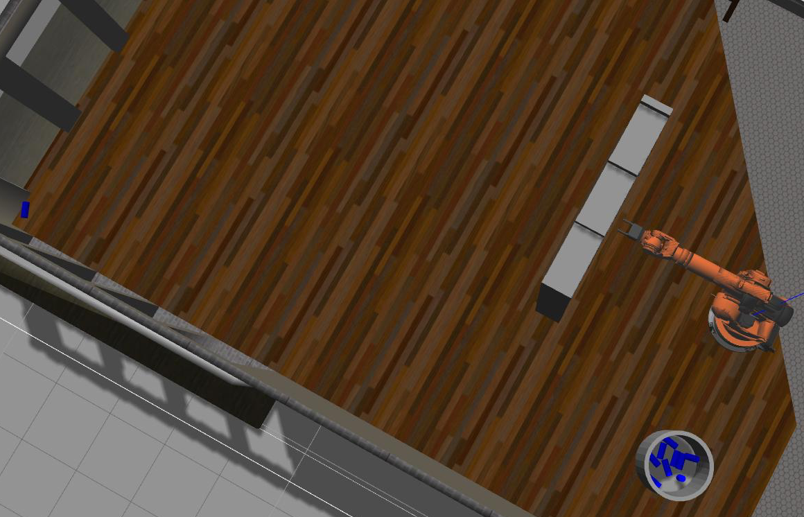

# Robotics Arm: Pick & Place

### Forward and Inverse Kinematics - The Amazon Challenge Pick and Place Robot Kinematics project.

## Introduction

The object of the Pick and Place project is to write inverse kinematics formulae that implement the Amazon Pick and Place challenge, to correctly pick an item off a shelf at a random location and place it in a bin. To succeed the implementation must do this 8 out of 10 times.

Kinematics refers to position in space without regard to weights or forces. Inverse kinematics in this project involves the calculation of robot joint angles to position a Kuka KR210 robot arm at the position of an item so it can be grasped and follow a trajectory to release the item in a bin. Inverse kinematics is challenging as there are multiple solutions to the problem.

The project involves calculating the inverse kinemtics equations and modifying the file IK_server.py to implement the solution in the context of an RVIZ/Gazebo environment that has been set up by the course creators.

This image shows the gazebo environment with the shelf, the items (blue cylinders) and the Kuka robot arm in the simulation environment:

Full documentation can be found here: 

<a href="https://github.com/douglasteeple/PickAndPlace/PickAndPlace.pdf" target=_blank>PickAndPlace.pdf</a>

## The Process

1. Draw a schematic of the 6 degrees of freedom of the Kuka arm, label the joints and links.

2. Create a table of the distances from the base position.

3. Create a table of the DH parameters.

4. Create the forward kinematics matrices as sympy matrix types.

5. Create the inverse kinematics equations based on an analysis of the robot arm.

## Software Implementation

First I split IK_server.py into two modules - IK_server.py and IK_calcs.py for greater clarity. KI_server.py handles communications with the ROS system and IK_calcs handles the kinematic calculations.

### IK_calcs

IK_calcs.py has a **main** entry point so it can be run in test mode from the command line. IK_calcs.py is split into two sections: forward kinematics and inverse kinematics. The main function `IK_calcs()` accepts 3 dimensional point data, position data and pitch, roll, yaw parameters. It first calls the `evalf()` function on the forward kinematic matrix at the rest position as a sanity check. Next the inverse kinematic function `ReverseGeometryCalcs()` is called the evaluate the inverse kinematic formulae to create the ⍬i values. The equations follow those developed in the analysis section. Note the addition of a call to the function `inrange()` which trims any angle calculations to be within the minima and maxima for the Kuka KR 210, taken from the Kuka documentation.

### Software Environment

The project runs on Ubuntu Linux 16.04 and all the required software on an external USB drive bootable from a MacBook pro. The project uses the Kinetic version of ROS native on Ubuntu. The RoboND-Kinematics-Project environment is installed as per the class instructions.

### Results

After some trial and error tweaking parameters, the implementation successfully dropped 9 out of 10 cylinders in the bin, thus satisfying the project rubric.

The ninth cylinder goes in the bin:

And mission accomplished:

Note one  cylinder off in the corner...

